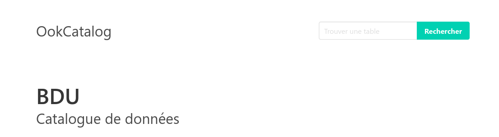
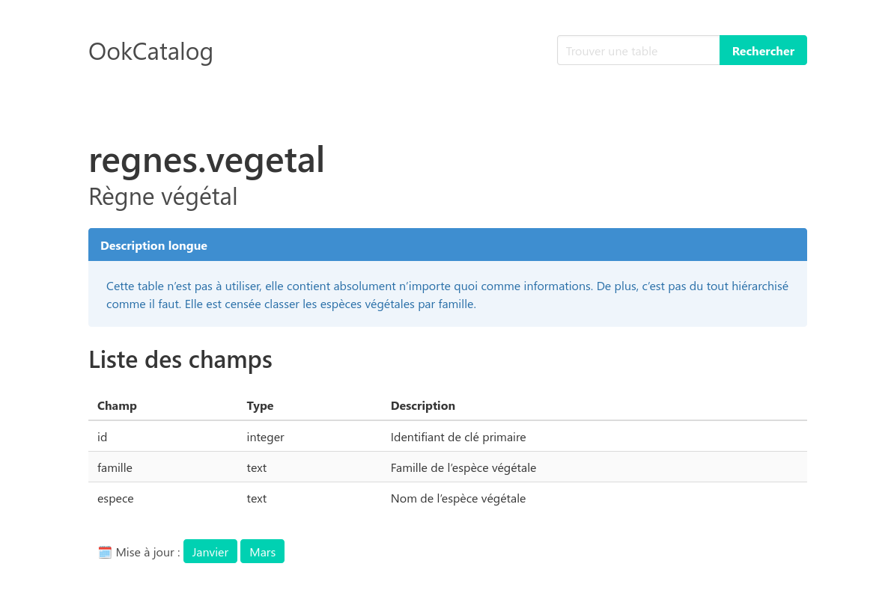
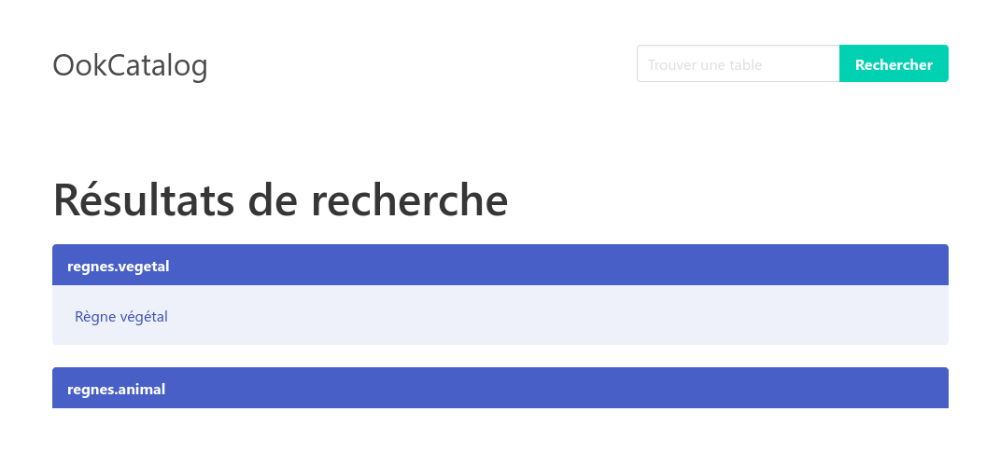

# The Ook Catalog



## Description

OokCatalog is a very simple data catalog made for PostgreSQL. It’s been programmed with the philosophy of being
maintained and/or modified by geomaticians / database administrator and not by web developers. Therefore, it makes the
simplest use of Python code and SQL requests, and is mostly powered by the SQL comments you have already defined, so it
can easily be understood.

Also, it’ll work directly on the database to be catalogued, but will create very few items on it. Only a user, one table
and an enum.

Based on Flask, Psycopg, and Bulma.

> [!CAUTION]
> This very little catalog has some really important limitations :
> - As for now, there isn’t any authentication. This project is intended for **intranet use** only, as a public use
    would exceed its performances.
> - Well, the website hasn’t been optimized, as it would heavily complexify the code. It should work for a small
    organization. I’ll add feedbacks here.
> - Textual search is fully re-processed at each search. That might have an impact on your database, and i’ll add
    feedbacks for this as well.

### Features

Features of this project are based on my work needs

- Displaying tables and views accessible by your users
- A page for each table, including :
    - A longer description
    - A full list of the columns and their comment
    - Months of the year when the data is updated
- Full text search through table and column names and descriptions

> [!IMPORTANT]
> Although I’ve programmed in english, all the displayed text is actuall in french with no support for localization.

These might come later :

- Correctly handle 404 when a table doesn’t exist
- Warning the administrators of the incoming updates
- A script to automatically add new tables in `public.ookcatalog`, and eventually to remove no-longer existing ones.
- Editing long description and months of update through a web based interface

### Sreenshots





## Installation

### Setting up the database

#### Creating an access to the database

First, we create a user for ookcatalog.

```postgresql
CREATE USER ookcatalog WITH PASSWORD 'ookcatalog_pass';
```

Set the password to whichever pass you want. Then, we grant this user access to the same tables our users have access
to. There are 2 options :

- Grant it the same role as the normal users
- Or, if your users have writing access and you don’t want OokCatalog to have it, as it could be a threat to your
  data integrity, you can grant it usage and select on the same schemas and tables. But it’s longer.

My users have no writing access, so I can give it the same role :

```postgresql
GRANT grp_user_bdu to ookcatalog;
```

#### Setting up its needed data

OokCatalog needs really few thing to work with, a custom enum type and a table.

The enum type allows registering months. We create it as below :

```postgresql
CREATE TYPE ookcatalog_month AS ENUM (
    'Janvier',
    'Février',
    'Mars',
    'Avril',
    'Mai',
    'Juin',
    'Juillet',
    'Août',
    'Septembre',
    'Octobre',
    'Novembre',
    'Décembre'
    );
```

> [!TIP]
> This is the moment to translate it if you want. Translating it now doesn’t need any other change elsewhere. You can
> also change the order of the enum, for example if you’d rather think with student years.

We then create the table where the catalog will access some data (as of now, long descriptions of tables and months of
upadte).

```postgresql
CREATE TABLE public.ookcatalog
(
    table_schema     TEXT NOT NULL,
    table_name       TEXT NOT NULL,
    description_long TEXT,
    update_months    OOKCATALOG_MONTH[],
    PRIMARY KEY (table_schema, table_name)
);

ALTER TABLE public.ookcatalog
    OWNER TO ookcatalog;
```

### Deploying OokCatalog

### Create a python environment

Create a python environment where you want to install OokCatalog. You can then use PyPi to download and install the last
published version of the catalog.

```commandline
pip install ookcatalog
```

### Configure OokCatalog

Download [config_sample.py](./config_sample.py). Edit the file according to your situation and register it where you
want to keep it. When you launch OokCatalog, use the environment variable to point to your config file. If the
environment variable isn’t set, the app will crash.

```commandline
OOKCATALOG_SETTINGS='/absolute/path/to/config.py' server_run_command
```

You can also set the path to your config file as a relative path, but keep in mind that OokCatalog will look for it
based on the instance folder. That means that the root of the relative path will be based on your venv folder :

```commandline
.venv/var/ookcatalog-instance/
```

You can export / set the environment variable if desired, for example on Linux :

```commandline
export OOKCATALOG_SETTINGS='/absolute/path/to/config.py' server_run_command
```

I’ve tried on Windows 11 using the `set` command, which didn’t work (either because Windows, or because it needs
administrator rights but won’t tell you). You might need to set the environment variable through the graphical
interface.

When launching the WSGI server, pass the OokCatalog app as a parameter. For example, full command with Waitress could
be :

```commandline
OOKCATALOGUE_SETTINGS='/var/www/ookcatalog/config.py' waitress-serve --call 'ookcatalog:create_app'
```

## Usage

You can modify the long description and update months in you new table `public.ookcatalog`. You need to manually add
the tables you want to describe by correctly entering `table_schema` and `table_name` so it matches existing tables.

To enter update_months, you need to use the textual array syntax, for example: `'{Janvier, Mars, Septembre}'`. You need
to single quote the whole array and not individual months. Be wary that this is case-sensitive (`Janvier != janvier`).